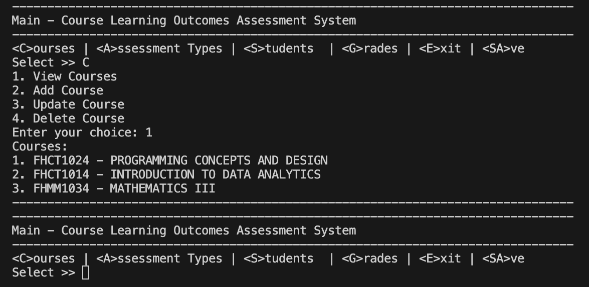

# Student and Course Management System (Python)

A small command-line application to manage students, courses, assessments, and grades using simple text files as storage.

Demo link: https://onlinegdb.com/4DaH0fiuc



## Overview

This project provides basic operations to add and manage students, courses, assessment types, and grades. It's implemented as a lightweight Python script intended for learning and small-scale usage.

## Installation

1. Clone or download the repository.
2. Ensure the project files are in a single directory alongside the data files.

## Running

Run the main script from the project root:

```
python Source.py
```

The script runs as a CLI application and will prompt for input (add students, record grades, show reports, etc.).

## Project files

- `Source.py` — main program entrypoint.
- `students.txt` — stores student records.
- `courses.txt` — stores course records.
- `grades.txt` — stores grades and assessments.
- `assessment_types.txt` — lists assessment types used by the system.

## Usage examples

- Start the program and follow prompts to add a student, enroll in a course, and record a grade.
- Example run: after launching, choose the menu option to add a student, then use the options to add courses and grades.

